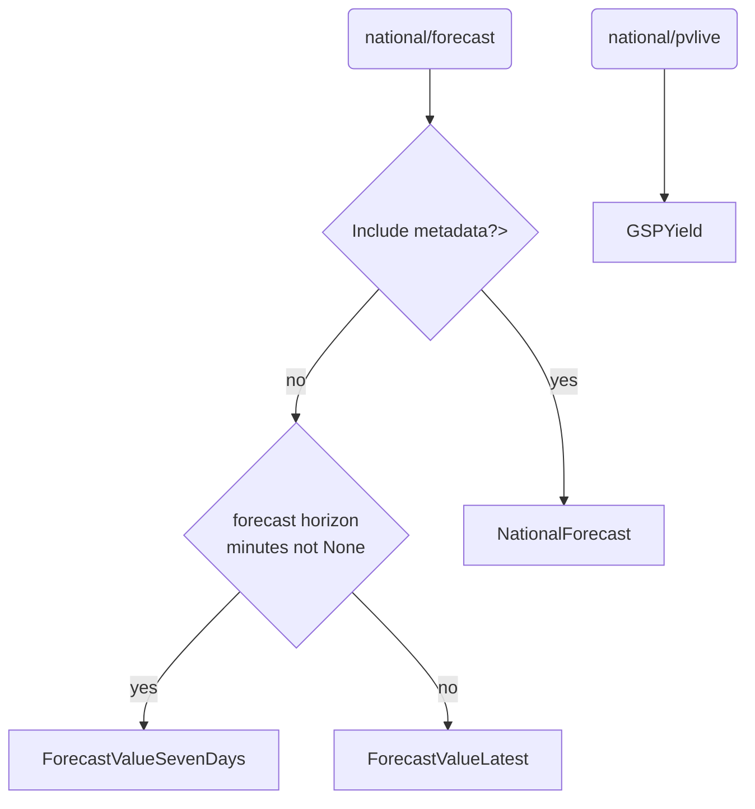
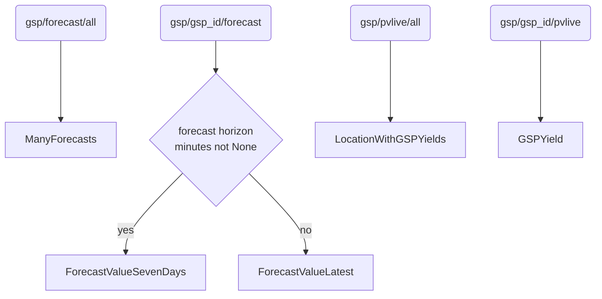
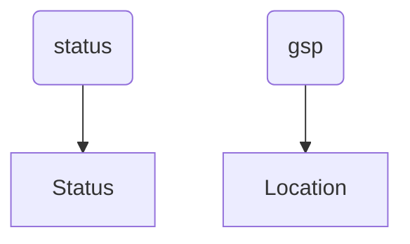
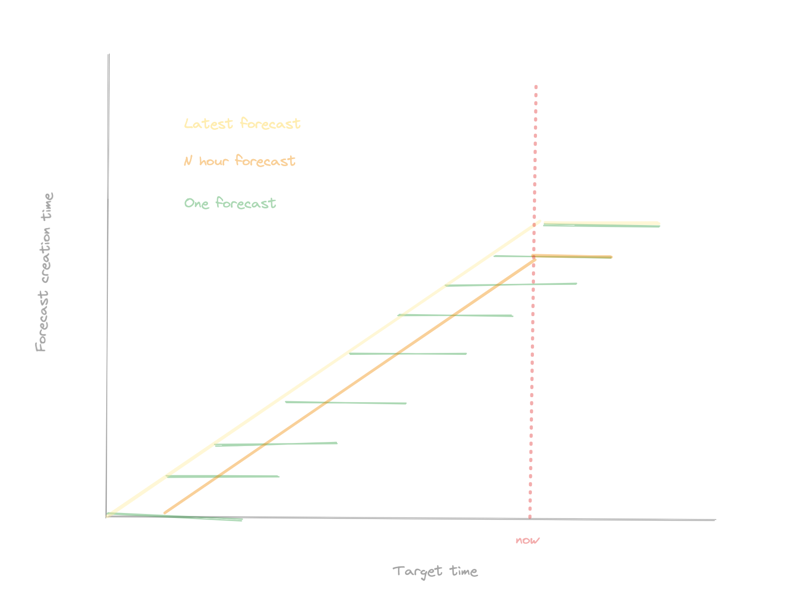

# UK PV National and GSP API

<!-- ALL-CONTRIBUTORS-BADGE:START - Do not remove or modify this section -->
[](#contributors-)
<!-- ALL-CONTRIBUTORS-BADGE:END -->

[](https://github.com/openclimatefix/uk-pv-national-gsp-api/tags)
[](https://github.com/openclimatefix#how-easy-is-it-to-get-involved)
[](https://github.com/openclimatefix/uk-pv-national-gsp-api/actions/workflows/test-docker.yaml)

API for hosting nowcasting solar predictions. This is for GSP and National forecasts in the UK.

We use [FastAPI](https://fastapi.tiangolo.com/).

## Installation

Pull the docker image from

```
docker pull openclimatefix/nowcasting_api:latest
```

You will need to set the following environment variables:
- `AUTH0_DOMAIN` - The Auth0 domain which can be collected from the Applications/Applications tab. It should be something like
'XXXXXXX.eu.auth0.com'
- `AUTH0_API_AUDIENCE` - THE Auth0 api audience, this can be collected from the Applications/APIs tab. It should be something like
`https://XXXXXXXXXX.eu.auth0.com/api/v2/`
- `DB_URL`- The Forecast database URL used to get GSP forecast data
- `ORIGINS` - Endpoints that are valid CORS origins. See [FastAPI documentation](https://fastapi.tiangolo.com/tutorial/cors/).
- `N_HISTORY_DAYS` - Default is just to load data from today and yesterday,
    but we can set this to 5, if we want the api always to return 5 days of data
- `ADJUST_MW_LIMIT` - the maximum the api is allowed to adjust the national forecast by
- `FAKE` - This allows fake data to be used, rather than connecting to a database
- `QUERY_WAIT_SECONDS` - The number of seconds to wait for an on going query
- `CACHE_TIME_SECONDS` - The time in seconds to cache the data is used for
- `DELETE_CACHE_TIME_SECONDS` - The time in seconds to after which the cache is delete
- `LOGLEVEL` - The log level for the application.

Note you will need a database set up at `DB_URL`. This should use the datamodel in [nowcasting_datamodel](https://github.com/openclimatefix/nowcasting_datamodel)

There are several optional environment variables:
- `N_CALLS_PER_HOUR` - API rate limit for most endpoints. Defaults to 3600 (1 per second).
- `N_SLOW_CALLS_PER_MINUTE` - API rate limit for slow endpoints. Defaults to 1 (1 per minute).

## Documentation

Live documentation can be viewed at `https://api.quartz.solar/docs` or `https://api.quartz.solar/swagger`.
This is automatically generated from the code.

## Development

This can be done it two different ways: With Python or with Docker.
The Docker method is preferred, because:
- a) this should be more replicable and less prone to odd behaviors;
- b) it also sets up a CRON service that generates new data periodically, to resemble the "real" forecast service.

### Python

Create a virtual env

```bash
python3 -m venv ./venv
source venv/bin/activate
```

### Running the API

#### Option 1: Docker
 🟢 __Preferred method__

1. Make sure docker is installed on your system.
2. Use `docker compose up`
   in the main directory with the optional `--build` flag to build the image the first time
   to start up the application. This builds the image, sets up the database, seeds some fake data
   and starts the API.
3. You will now be able to access it on `http://localhost:8000`
4. The API should restart automatically when you make changes to the code, and the CRON job will
   periodically seed new fake data, currently set to every 15 minutes.

#### Option 2: Running docker with a local version of [nowcasting_datamodel](https://github.com/openclimatefix/nowcasting_datamodel)
1. Clone the [nowcasting_datamodel](https://github.com/openclimatefix/nowcasting_datamodel) repository
2. Comment out the `nowcasting_datamodel` line in the `requirements.txt` file
3. Run `docker compose up --file docker-compose-local-datamodel.yml` in the main directory, with the
   optional `--build` flag to build the image the first time; this will start up the application and seed the
   initial fake data in the database.
4. You will now be able to access it on `http://localhost:8000`. Changes you make to the API code will be
   automatically reflected in the running API, but changes to the datamodel will either require a change of any kind
   in the API code that will reload the server, or a manual restart of the API.
5. Data will reseed every 15 minutes.

#### Option 3: Running the API with a local database (deprecated, but possible if unable to use Docker, may require some troubleshooting)

To set up the API with a local database, you will need to:
 - start your own local postgres instance on your machine
 - set `DB_URL` to your local postgres instance in the `.env` file
 - run the following commands to install required packages, create the tables in your local postgres instance, and populate them with fake data:

```bash
pip install -r requirements.txt
python script/fake_data.py
cd nowcasting_api
uvicorn main:app --reload
```
When running locally:
1. You will now be able to access it on `http://localhost:8000`
2. The API should restart automatically when you make changes to the code, but the fake
   data currently is static. To seed new fake data, just manually restart the API.

### Running the test suite

To run tests use the following command
```bash
docker stop $(docker ps -a -q)
docker-compose -f test-docker-compose.yml build
docker-compose -f test-docker-compose.yml run api
```

### Routes to SQL tables
#### National


#### GSP


#### Extras




## FAQ

### What is a N hour forecast?

Some users want to know what the forecast was like N hours ago. We can do this by setting
`forecast_hoirzon_minutes` in the API.
Because the API provider forecasts in the future and historic values, it is useful to define this behaviour for N hour forecast.
- future: A forecast that was made N hours ago for the future.
For example, if its now 2025-01-01 12:00, the future will show a forecast made at 2025-01-01 08:00, from now to 2025-01-02 20:00 (a 36 hour forecast)
- past: Forecast values that were made N hours before the target time.
For example, a target_time of 2025-01-01 11:00 will show a forecast value made at 2025-01-01 07:00.





## Contributing and community

[](https://github.com/openclimatefix/ocf-template/issues?q=is%3Aissue+is%3Aopen+sort%3Aupdated-desc)

- PR's are welcome! See the [Organisation Profile](https://github.com/openclimatefix) for details on contributing
- Find out about our other projects in the [here](https://github.com/openclimatefix/.github/tree/main/profile)
- Check out the [OCF blog](https://openclimatefix.org/blog) for updates
- Follow OCF on [LinkedIn](https://uk.linkedin.com/company/open-climate-fix)


## Contributors


Thanks goes to these wonderful people ([emoji key](https://allcontributors.org/docs/en/emoji-key)):

<!-- ALL-CONTRIBUTORS-LIST:START - Do not remove or modify this section -->
<!-- prettier-ignore-start -->
<!-- markdownlint-disable -->
<table>
  <tbody>
    <tr>
      <td align="center" valign="top" width="14.28%"><a href="https://github.com/peterdudfield"><br /><sub><b>Peter Dudfield</b></sub></a><br /><a href="https://github.com/openclimatefix/uk-pv-national-gsp-api/commits?author=peterdudfield" title="Code">💻</a></td>
      <td align="center" valign="top" width="14.28%"><a href="https://github.com/mdfaisal98"><br /><sub><b>Mohammed Faisal</b></sub></a><br /><a href="https://github.com/openclimatefix/uk-pv-national-gsp-api/commits?author=mdfaisal98" title="Code">💻</a></td>
      <td align="center" valign="top" width="14.28%"><a href="https://github.com/BodaleDenis"><br /><sub><b>Bodale Denis</b></sub></a><br /><a href="https://github.com/openclimatefix/uk-pv-national-gsp-api/commits?author=BodaleDenis" title="Code">💻</a></td>
      <td align="center" valign="top" width="14.28%"><a href="https://github.com/OBITORASU"><br /><sub><b>Souhit Dey</b></sub></a><br /><a href="https://github.com/openclimatefix/uk-pv-national-gsp-api/commits?author=OBITORASU" title="Code">💻</a></td>
      <td align="center" valign="top" width="14.28%"><a href="https://github.com/flowirtz"><br /><sub><b>Flo</b></sub></a><br /><a href="https://github.com/openclimatefix/uk-pv-national-gsp-api/commits?author=flowirtz" title="Code">💻</a></td>
      <td align="center" valign="top" width="14.28%"><a href="https://github.com/vnshanmukh"><br /><sub><b>Shanmukh</b></sub></a><br /><a href="https://github.com/openclimatefix/uk-pv-national-gsp-api/commits?author=vnshanmukh" title="Code">💻</a></td>
      <td align="center" valign="top" width="14.28%"><a href="http://www.sixte.demaupeou.com"><br /><sub><b>Sixte de Maupeou</b></sub></a><br /><a href="https://github.com/openclimatefix/uk-pv-national-gsp-api/commits?author=sixtedemaupeou" title="Code">💻</a></td>
    </tr>
    <tr>
      <td align="center" valign="top" width="14.28%"><a href="https://github.com/rachel-labri-tipton"><br /><sub><b>rachel tipton</b></sub></a><br /><a href="https://github.com/openclimatefix/uk-pv-national-gsp-api/commits?author=rachel-labri-tipton" title="Code">💻</a></td>
      <td align="center" valign="top" width="14.28%"><a href="https://github.com/braddf"><br /><sub><b>braddf</b></sub></a><br /><a href="https://github.com/openclimatefix/uk-pv-national-gsp-api/commits?author=braddf" title="Code">💻</a></td>
      <td align="center" valign="top" width="14.28%"><a href="http://dorinclisu.github.io"><br /><sub><b>Dorin</b></sub></a><br /><a href="https://github.com/openclimatefix/uk-pv-national-gsp-api/pulls?q=is%3Apr+reviewed-by%3Adorinclisu" title="Reviewed Pull Requests">👀</a></td>
      <td align="center" valign="top" width="14.28%"><a href="http://petermnhull.github.io"><br /><sub><b>Peter Hull</b></sub></a><br /><a href="https://github.com/openclimatefix/uk-pv-national-gsp-api/commits?author=petermnhull" title="Code">💻</a></td>
      <td align="center" valign="top" width="14.28%"><a href="https://www.breakingpitt.es"><br /><sub><b>Pedro Garcia Rodriguez</b></sub></a><br /><a href="https://github.com/openclimatefix/uk-pv-national-gsp-api/commits?author=BreakingPitt" title="Code">💻</a></td>
      <td align="center" valign="top" width="14.28%"><a href="https://richasharma.co.in/"><br /><sub><b>Richa</b></sub></a><br /><a href="https://github.com/openclimatefix/uk-pv-national-gsp-api/commits?author=14Richa" title="Code">💻</a></td>
      <td align="center" valign="top" width="14.28%"><a href="https://github.com/pwdemars"><br /><sub><b>Patrick de Mars</b></sub></a><br /><a href="#question-pwdemars" title="Answering Questions">💬</a></td>
    </tr>
    <tr>
      <td align="center" valign="top" width="14.28%"><a href="https://github.com/VikramsDataScience"><br /><sub><b>Vikram Pande</b></sub></a><br /><a href="https://github.com/openclimatefix/uk-pv-national-gsp-api/commits?author=VikramsDataScience" title="Code">💻</a></td>
      <td align="center" valign="top" width="14.28%"><a href="http://rpep.dev"><br /><sub><b>Dr Ryan Pepper</b></sub></a><br /><a href="https://github.com/openclimatefix/uk-pv-national-gsp-api/commits?author=rpep" title="Code">💻</a></td>
      <td align="center" valign="top" width="14.28%"><a href="https://github.com/pvprajwal"><br /><sub><b>Parasa V Prajwal</b></sub></a><br /><a href="https://github.com/openclimatefix/uk-pv-national-gsp-api/commits?author=pvprajwal" title="Code">💻</a></td>
      <td align="center" valign="top" width="14.28%"><a href="https://github.com/mahmoud-40"><br /><sub><b>Mahmoud Abdulmawlaa</b></sub></a><br /><a href="https://github.com/openclimatefix/uk-pv-national-gsp-api/commits?author=mahmoud-40" title="Code">💻</a></td>
      <td align="center" valign="top" width="14.28%"><a href="https://github.com/abdalahsalah"><br /><sub><b>Abdallah salah</b></sub></a><br /><a href="https://github.com/openclimatefix/uk-pv-national-gsp-api/commits?author=abdalahsalah" title="Code">💻</a></td>
      <td align="center" valign="top" width="14.28%"><a href="https://github.com/Dakshbir"><br /><sub><b>Dakshbir</b></sub></a><br /><a href="https://github.com/openclimatefix/uk-pv-national-gsp-api/commits?author=Dakshbir" title="Code">💻</a></td>
      <td align="center" valign="top" width="14.28%"><a href="https://github.com/michael-gendy"><br /><sub><b>michael-gendy</b></sub></a><br /><a href="https://github.com/openclimatefix/uk-pv-national-gsp-api/commits?author=michael-gendy" title="Code">💻</a></td>
    </tr>
  </tbody>
</table>

<!-- markdownlint-restore -->
<!-- prettier-ignore-end -->

<!-- ALL-CONTRIBUTORS-LIST:END -->

---

*Part of the [Open Climate Fix](https://github.com/orgs/openclimatefix/people) community.*


