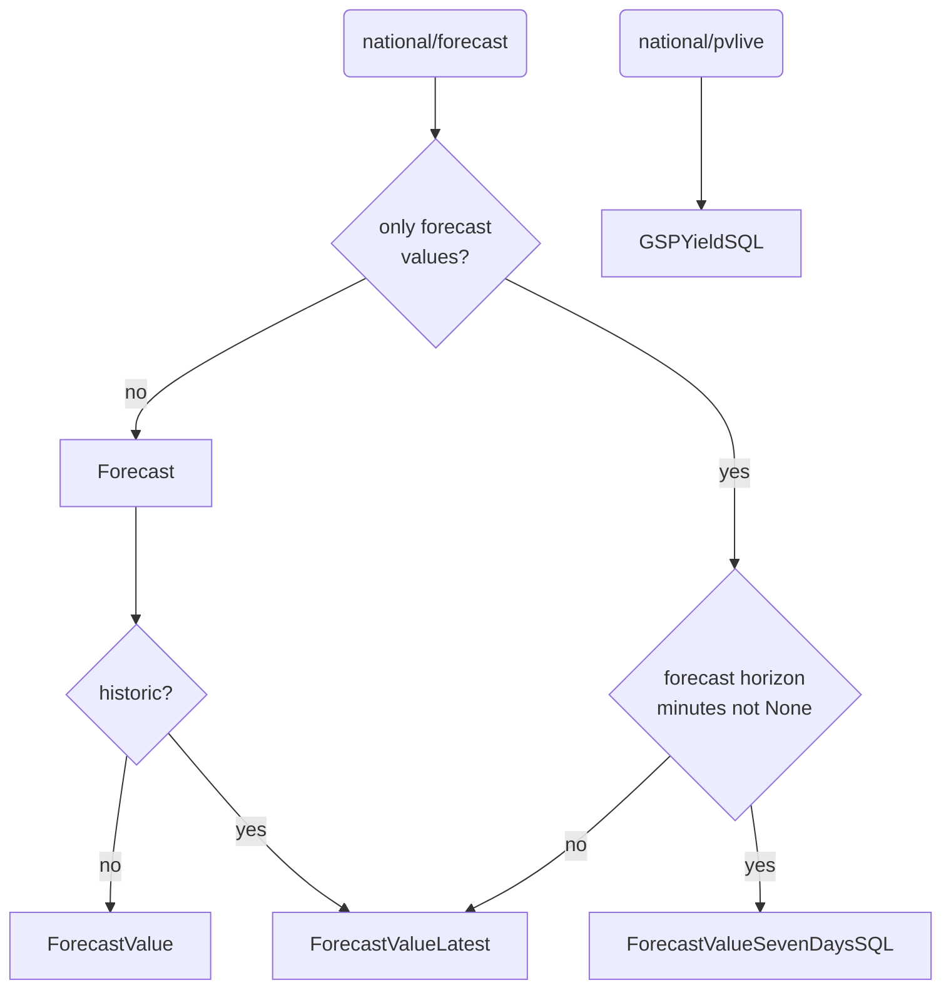
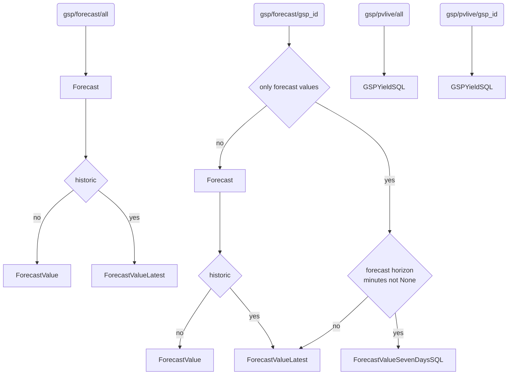
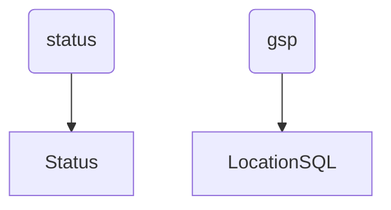

# Nowcasting API

<!-- ALL-CONTRIBUTORS-BADGE:START - Do not remove or modify this section -->
[](#contributors-)
<!-- ALL-CONTRIBUTORS-BADGE:END -->

[](https://codecov.io/gh/openclimatefix/nowcasting_api)


API for hosting nowcasting solar predictions.
Will just return 'dummy' numbers until about mid-2022!

We use [FastAPI](https://fastapi.tiangolo.com/).

# Documentation

Documentation can be viewed at `/docs` or `/swagger`. This is automatically generated from the code.

# Setup and Run

This can be done it two different ways: With Python or with Docker.

## Python

### Create a virtual env

```bash
python3 -m venv ./venv
source venv/bin/activate
```

### Install Requirements and Run

```bash
pip install -r requirements.txt
cd src && uvicorn main:app --reload
```

## Docker

1. Make sure docker is installed on your system.
2. Use `docker-compose up`
   in the main directory to start up the application.
3. You will now be able to access it on `http://localhost:80`

### Tests

TO run tests use the following command
```bash
docker stop $(docker ps -a -q)
docker-compose -f test-docker-compose.yml build
docker-compose -f test-docker-compose.yml run api
```

# Development

We use `pre-commit` to manage various pre-commit hooks. All hooks are also run
as Actions when code is pushed to GitHub.

You can run the formatters and linters locally. To do that:

1. [Install pre-commit](https://pre-commit.com/#install)
2. Check the install worked via `pre-commit --version`
3. Install the git hooks script via `pre-commit install`

# Deployment

Deployment of this service is now done through terraform cloud.

# Environmental Variables

- `AUTH0_DOMAIN` - The Auth0 domain which can be collected from the Applications/Applications tab. It should be something like
'XXXXXXX.eu.auth0.com'
- `AUTH0_API_AUDIENCE` - THE Auth0 api audience, this can be collected from the Applications/APIs tab. It should be something like
`https://XXXXXXXXXX.eu.auth0.com/api/v2/`
- `DB_URL`- The Forecast database URL used to get GSP forecast data
- `DB_URL_PV` - The PV database URL, used to get PV data
- `ORIGINS` - Endpoints that are valid CORS origins. See [FastAPI documentation](https://fastapi.tiangolo.com/tutorial/cors/).
- `N_HISTORY_DAYS` - Default is just to load data from today and yesterday,
    but we can set this to 5, if we want the api always to return 5 days of data
- `FORECAST_ERROR_HOURS` - using route `/v0/system/GBstatus/check_last_forecast_run` we can check if a forecast has
        been made in the last `FORECAST_ERROR_HOURS` hours
- `ADJUST_MW_LIMIT` - the maximum the api is allowed to adjust the national forecast by

## Routes to SQL tables

### National


### GSP


### Extras




# Contributors ✨

Thanks goes to these wonderful people ([emoji key](https://allcontributors.org/docs/en/emoji-key)):

<!-- ALL-CONTRIBUTORS-LIST:START - Do not remove or modify this section -->
<!-- prettier-ignore-start -->
<!-- markdownlint-disable -->
<table>
  <tbody>
    <tr>
      <td align="center"><a href="https://github.com/peterdudfield"><br /><sub><b>Peter Dudfield</b></sub></a><br /><a href="https://github.com/openclimatefix/nowcasting_api/commits?author=peterdudfield" title="Code">💻</a></td>
      <td align="center"><a href="https://github.com/mdfaisal98"><br /><sub><b>Mohammed Faisal</b></sub></a><br /><a href="https://github.com/openclimatefix/nowcasting_api/commits?author=mdfaisal98" title="Code">💻</a></td>
      <td align="center"><a href="https://github.com/BodaleDenis"><br /><sub><b>Bodale Denis</b></sub></a><br /><a href="https://github.com/openclimatefix/nowcasting_api/commits?author=BodaleDenis" title="Code">💻</a></td>
      <td align="center"><a href="https://github.com/OBITORASU"><br /><sub><b>Souhit Dey</b></sub></a><br /><a href="https://github.com/openclimatefix/nowcasting_api/commits?author=OBITORASU" title="Code">💻</a></td>
      <td align="center"><a href="https://github.com/flowirtz"><br /><sub><b>Flo</b></sub></a><br /><a href="https://github.com/openclimatefix/nowcasting_api/commits?author=flowirtz" title="Code">💻</a></td>
      <td align="center"><a href="https://github.com/vnshanmukh"><br /><sub><b>Shanmukh</b></sub></a><br /><a href="https://github.com/openclimatefix/nowcasting_api/commits?author=vnshanmukh" title="Code">💻</a></td>
      <td align="center"><a href="http://www.sixte.demaupeou.com"><br /><sub><b>Sixte de Maupeou</b></sub></a><br /><a href="https://github.com/openclimatefix/nowcasting_api/commits?author=sixtedemaupeou" title="Code">💻</a></td>
    </tr>
    <tr>
      <td align="center"><a href="https://github.com/rachel-labri-tipton"><br /><sub><b>rachel tipton</b></sub></a><br /><a href="https://github.com/openclimatefix/nowcasting_api/commits?author=rachel-labri-tipton" title="Code">💻</a></td>
      <td align="center"><a href="https://github.com/braddf"><br /><sub><b>braddf</b></sub></a><br /><a href="https://github.com/openclimatefix/nowcasting_api/commits?author=braddf" title="Code">💻</a></td>
    </tr>
  </tbody>
</table>

<!-- markdownlint-restore -->
<!-- prettier-ignore-end -->

<!-- ALL-CONTRIBUTORS-LIST:END -->

This project follows the [all-contributors](https://github.com/all-contributors/all-contributors) specification. Contributions of any kind welcome!
